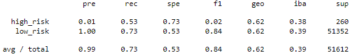

# Credit_Risk_Analysis
 
## Overview

The purpose of this analysis is to assess the credit risk of individuals based on a number of features. Three machine learning models were used to assess risk. Each model is evaluated for performance.

## Results

### Resampling Models

#### RandomOversampler

    - Accuracy: 0.74
    - Classification Report:
    -

#### 