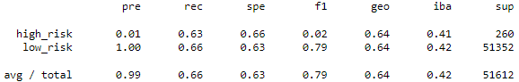
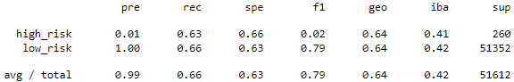

# Credit_Risk_Analysis
 
## Overview

The purpose of this analysis is to assess the credit risk of individuals based on a number of features. Three machine learning models were used to assess risk. Each model is evaluated for performance.

## Results

### Resampling Models

#### RandomOversampler

    - Accuracy: 0.74
    - Precision:
        - low_risk: 1.00
        - high_risk: 0.01
    - Recall: 
        - low_risk: 0.74
        - high_risk: 0.53

##### Classification Report:

#### SMOTE Oversampling

    - Accuracy: 0.64
    - Precision:
        - low_risk: 1.00
        - high_risk: 0.01
    - Recall: 
        - low_risk: 0.66
        - high_risk: 0.63

##### Classification Report:

#### ClusterCentroid Undersampling

    - Accuracy: 0.64
    - Precision:
        - low_risk: 1.00
        - high_risk: 0.01
    - Recall: 
        - low_risk: 0.66
        - high_risk: 0.63

##### Classification Report:

#### SMOTEENN Combination

    - Accuracy: 0.64
    - Precision:
        - low_risk: 1.00
        - high_risk: 0.01
    - Recall: 
        - low_risk: 0.66
        - high_risk: 0.63

##### Classification Report:

#### RandomForest Classifier

    - Accuracy: 0.86
    - Precision:
        - low_risk: 1.00
        - high_risk: 0.02
    - Recall: 
        - low_risk: 0.86
        - high_risk: 0.64

##### Classification Report:

#### AdaBoost Classifier

    - Accuracy: 0.87
    - Precision:
        - low_risk: 1.00
        - high_risk: 0.03
    - Recall: 
        - low_risk: 0.81
        - high_risk: 0.87

##### Classification Report:

